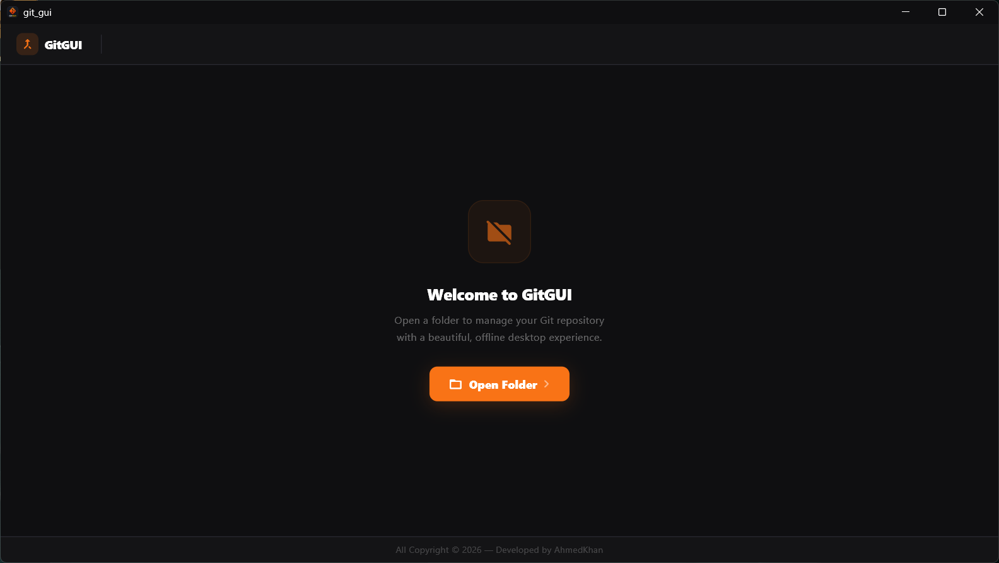

<div align="center">

<br/>


<br/><br/>

# 🟠 GitGUI

### A Beautiful, Free & Open-Source Git Desktop Client

> Manage your Git repositories with a sleek, modern desktop interface — built with Flutter.  
> No command line needed. Visualize commits, manage branches, and track changes effortlessly.

**v0.1.0** · Built with ❤️ by **AhmedKhan**

[Features](#-features) · [Screenshots](#-screenshots) · [Getting Started](#-getting-started) · [Architecture](#-architecture) · [Contributing](#-contributing)

---

</div>

<br/>

## ✨ Features

| Feature | Description |
|---------|-------------|
| 📂 **Open Repository** | Pick any local folder and instantly load it as a Git repository |
| 🆕 **Initialize Repo** | Turn any folder into a Git repo with one click |
| 📜 **Commit Timeline** | Scrollable, visual timeline of your entire commit history |
| ✏️ **Stage & Commit** | Write a message, hit commit — all changes are auto-staged and saved |
| 🔀 **Checkout Commits** | Click any commit to check it out and browse your project history |
| 🌿 **Branch Detection** | Current branch shown with color-coded badges (green = active, red = detached) |
| 🔙 **Return to Main** | One-click button to return to `main`/`master` from a detached HEAD state |
| 📊 **Live Status** | Real-time working tree status — see changed files at a glance |
| 🌙 **Dark Theme** | Gorgeous dark UI with orange accent — easy on the eyes, day or night |
| 💯 **100% Offline** | No cloud, no telemetry — everything runs locally on your machine |

<br/>

## 📸 Screenshots

### Welcome Screen
<p align="center">
  
</p>

### Repository Loaded — Commit History
<p align="center">
  
</p>

### Making a Commit
<p align="center">
  
</p>

### Commit Timeline View
<p align="center">
  
</p>

### Branch & Status Overview
<p align="center">
  
</p>

<br/>

## 🚀 Getting Started

### Prerequisites

Make sure you have the following installed:

- **[Flutter](https://flutter.dev/docs/get-started/install)** (SDK `>= 3.11.5`)
- **[Git](https://git-scm.com/downloads)** (must be available in your system PATH)
- **Windows 10/11** (currently supports Windows desktop)

### Installation

```bash
# 1. Clone the repository
git clone https://github.com/your-username/git-GUI.git

# 2. Navigate to the project
cd git-GUI/open-sorce

# 3. Install dependencies
flutter pub get

# 4. Run the app
flutter run -d windows
```

### Build Release

```bash
cd open-sorce
flutter build windows --release
```

The executable will be in `build/windows/x64/runner/Release/`.

<br/>

## 🏗️ Architecture

GitGUI follows a clean **Provider-based** architecture with clear separation of concerns:

```
lib/
├── main.dart                  # App entry point & theme configuration
├── models/
│   └── git_commit.dart        # GitCommit data model
├── providers/
│   └── git_state.dart         # Central state management (ChangeNotifier)
├── services/
│   └── git_service.dart       # Git CLI wrapper (Process.run)
├── screens/
│   └── home_screen.dart       # Main screen with split-panel layout
└── widgets/
    ├── top_nav_bar.dart       # Top navigation bar with branch/status chips
    ├── commit_card.dart       # Timeline-style commit card with dot indicator
    ├── commit_form.dart       # Compact commit message form
    └── empty_state.dart       # Welcome & empty state with CTA buttons
```

### Tech Stack

| Layer | Technology |
|-------|-----------|
| **UI Framework** | Flutter (Material Design) |
| **State Management** | Provider (`ChangeNotifierProvider`) |
| **Git Operations** | `dart:io` → `Process.run` (native Git CLI) |
| **File Picker** | `file_picker` package |
| **Platform** | Windows Desktop |

### Design System

| Element | Value |
|---------|-------|
| **Primary Accent** | `#F97316` (Orange) |
| **Success / Active** | `#22C55E` (Green) |
| **Error / Danger** | `#EF4444` (Red) |
| **Background** | `#0F0F11` (Near Black) |
| **Surface** | `#1A1A1F` (Dark Gray) |
| **Font Family** | Segoe UI |

<br/>

## 📋 How It Works

1. **Open a Folder** — Click "Open Folder" and select a local directory
2. **Auto-Detect** — GitGUI checks if it's a valid Git repository
3. **Not a Repo?** — Click "Initialize Git Repository" to run `git init`
4. **View History** — Browse your commit timeline in the left panel
5. **Make Commits** — Type a message and click "Commit" (auto-stages all changes)
6. **Checkout** — Hover over any past commit and click "Checkout" to navigate
7. **Detached HEAD?** — A red badge appears with a "Return to Main" button

<br/>

## 🤝 Contributing

Contributions are welcome! Here's how to get started:

1. **Fork** the repository
2. **Create** a feature branch: `git checkout -b feature/amazing-feature`
3. **Commit** your changes: `git commit -m "Add amazing feature"`
4. **Push** to the branch: `git push origin feature/amazing-feature`
5. **Open** a Pull Request

Please make sure your code follows the existing style and includes meaningful comments.

<br/>

## 📄 License

This project is licensed under the **Apache License 2.0** — see the [LICENSE](LICENSE) file for details.

```
Copyright © 2026 AhmedKhan
Licensed under the Apache License, Version 2.0
```

<br/>

---

<div align="center">

**If you found this project useful, consider giving it a ⭐ Star!**

<sub>Built with Flutter · Powered by Git · Made for Developers</sub>

</div>
